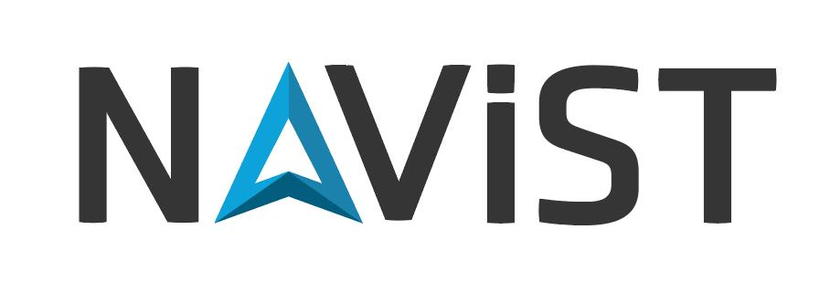
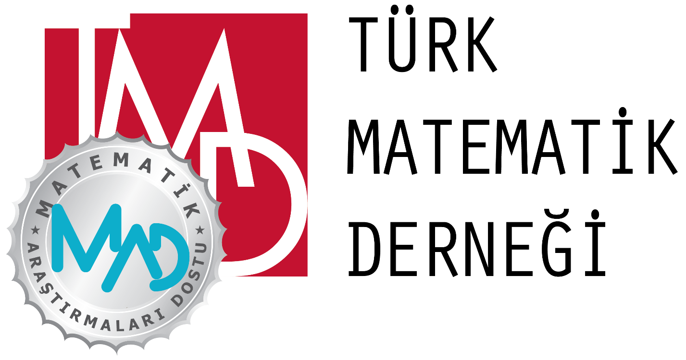

<nav class="navbar">
    <a href="#" class="logo">CGI 2025</a>
    <button class="menu-toggle" aria-label="Toggle navigation">
        
        
        
    </button>
    <ul class="nav-links">
        <li><a href="#speakers">Speakers</a></li>
        <li><a href="#committee">Committee</a></li>
        <li><a href="#accommodation">Accommodation</a></li>
        <li><a href="#submission">Abstract Submission</a></li>
        <li><a href="#register">Register</a></li>
        <li><a href="#schedule">Schedule</a></li>
        <li><a href="#directions">Directions</a></li>
        <!--<li><a href="#venue">Venue</a></li>-->
        <li><a href="#contact">Contact</a></li>
        <li><a href="#sponsors">Sponsors</a></li>
    </ul>
</nav>

Welcome to the "Combinatorics and Geometry in İstanbul" workshop, taking place on August 5 and 6 in the enchanting city of İstanbul. This two-day event is dedicated to bringing together researchers and enthusiasts in the fields of algebra, combinatorics, and geometry, fostering collaboration and the exchange of ideas in a vibrant academic setting.

The mornings will be highlighted by talks from our invited speakers, who will share their latest insights and advancements in their respective fields. In the afternoons, we will host a series of contributed talks, offering participants an opportunity to present their work and spark meaningful discussions.

We are delighted to convene this event in such a unique and inspiring location and look forward to two days of stimulating academic exchange and collaboration.

## Invited Speakers

- Ayesha Asloob Qureshi (Sabancı University)
  
- Martina Juhnke (University of Osnabrück)
  
- Russ Woodroofe (University of Primorska FAMNIT) [TBC]

- Tolga Birdal (Imperial College London)
  
- Volkmar Welker (Philipps-Universität Marburg)
  
- Yusuf Civan (Süleyman Demirel University)

## Scientific and Organising Committee

- Kağan Kurşungöz (Sabancı University)
  
- Müge Taşkın (Boğaziçi University)
  
- Nermine El Sissi (Bahçeşehir University)
  
- Selçuk Kayacan (Bahçeşehir University)

## Accommodation

### Hotels in the Beşiktaş Area

For a comprehensive list of hotels in the Beşiktaş area, you may visit:

<!--- [Booking.com](https://www.booking.com/district/tr/İstanbul/besiktas.html){:target="_blank"}-->

- [Hotels.com](https://www.hotels.com/nh1661016/hotels-in-besiktas-İstanbul-turkey/){:target="_blank"}
  
- [TripAdvisor](https://www.tripadvisor.com/HotelsNear-g293974-d2037618-Besiktas-İstanbul.html){:target="_blank"}

### Reserved Rooms at BAU Kemerburgaz (Future) Campus

We have reserved a limited number of rooms for participants from outside İstanbul at the BAU Kemerburgaz (Future) Campus. If you wish to stay in these accommodations, please indicate "Yes" to the corresponding question in the registration form. Additional details will be collected upon your affirmative response.

## Abstract Submission

We invite participants to submit abstracts for contributed talks. Each talk will be 30 minutes long, including Q&A. If your talk cannot be accommodated in the schedule, you may be invited to present a poster instead.

### Important Dates

- **Workshop**: August 5-6, 2025
  
- **Abstract Submission Deadline**: June 30, 2025
  
- **Notification of Acceptance**: July 15, 2025  

### Submission Guidelines

1. Download the abstract template: [Download abstract_template.tex](https://www.dropbox.com/scl/fi/5vnj4nk6twyatkvpn986v/abstract_template.tex?rlkey=mod0a5iboivd1uw3xjjvfolyh&dl=1)

2. Format your abstract using the provided template.

3. Upload your abstract (both TEX and PDF files) during the registration process.

Please indicate in the registration form if you are willing to present a poster in case your talk cannot be scheduled.

## Registration

Thanks to the generous support of our sponsors, the participation fee for the workshop is 400 TL. To register, please follow the steps below.

### 1. Payment Details

   Participants must transfer 400 TL to the following bank account:  
   - **Account Name**: BAHÇEŞEHİR ÜNİVERSİTESİ  
   - **Bank Name**: DENİZBANK / SURDIŞI TİCARİ MERKEZ ŞUBE  
   - **IBAN**: TR45 0013 4000 0019 9214 6006 78

   **Important**:     
   - Include the following in the payment description:
     
      `Name Surname (CGI2025 participation fee)`
     
   - Keep a copy of your payment receipt, as you will need to upload it during registration.  

### 2. Abstract Submission (Optional)

If you would like to present a talk, please follow the **Submission Guidelines** under the <a href="#submission">Abstract Submission</a> section. This includes downloading the abstract template, formatting your abstract, and uploading both the TEX and PDF files during registration.

Please indicate in the registration form if you are willing to present a poster in case your talk cannot be scheduled.
 

### 3. Complete Your Registration

   Click the link below to proceed with registration. You will be asked to fill in your details and upload the required documents.
   

    <a href="https://docs.google.com/forms/d/e/1FAIpQLSd1xg0MDgAUfiAWm_2IhGoJfB9bJ7-6cGuTmxXuNYDvxqMLWw/viewform?usp=preview" target="_blank" class="btn">Register Now</a>

   **Documents to Upload**:  
   - Your bank payment receipt  
   - Your abstract_template.tex file (only if you are giving a talk)  
   - Your compiled PDF file (only if you are giving a talk)
  

<!--
## Registration

Thanks to the generous support of our sponsors, the participation fee for the workshop is **400 TL**. To register, please follow the steps below.

### 1. Payment Details

Participants must transfer 400 TL to the following bank account:

**Bank Account Information**

- **Account Name**: BAHÇEŞEHİR ÜNİVERSİTESİ  
- **Bank Name**: DENİZBANK / SURDIŞI TİCARİ MERKEZ ŞUBE  
- **IBAN**: TR45 0013 4000 0019 9214 6006 78

**Important:**

- When making the payment, please include the following in the payment description:
  
  `Name Surname (CGI2025 participation fee)`

- Keep a copy of your payment receipt, as you will need to upload it during registration.

### 2. Abstract Submission (Optional)

If you would like to present a talk at the conference, please follow these steps:

1. Download the abstract template: [Download abstract_template.tex](https://www.dropbox.com/scl/fi/5vnj4nk6twyatkvpn986v/abstract_template.tex?rlkey=mod0a5iboivd1uw3xjjvfolyh&dl=1)
2. Format your abstract using this template.  
3. Upload your abstract file during the registration process (both TEX and PDF files).

**Talk Duration**: Each accepted talk will be **30 minutes** long, including Q&A.

### 3. Complete Your Registration

Click the link below to proceed with registration. You will be asked to fill in your details and upload the required documents.

    <a href="https://docs.google.com/forms/d/e/1FAIpQLSd1xg0MDgAUfiAWm_2IhGoJfB9bJ7-6cGuTmxXuNYDvxqMLWw/viewform?usp=preview" target="_blank" class="btn">Register Now</a>

You will need to upload:
- Your bank payment receipt
- Your abstract_template.tex file (only if you are giving a talk)
- Your compiled PDF file (only if you are giving a talk)
-->

## Workshop Schedule and Sessions  

To be announced!

## Directions

### Workshop Venue

    
<strong>Bahçeşehir University (BAU) South Campus</strong>

    
Yıldız, Çırağan Cd., 34349 Beşiktaş/İstanbul

<!-- Leaflet CSS -->
<link rel="stylesheet" href="https://unpkg.com/leaflet@1.9.4/dist/leaflet.css" />

<!-- Leaflet JS -->

 <!-- Ensure this path is correct -->

<!-- <iframe 
    width="600" 
    height="400" 
    frameborder="0" 
    style="border:0;" 
    src="https://www.bing.com/maps/embed?h=400&w=600&cp=41.0432~29.0092&lvl=15&typ=d&sty=r&src=SHELL&FORM=MBEDV8" 
    allowfullscreen>
</iframe> -->

<!-- <iframe 
    src="https://www.google.com/maps/embed?pb=!1m18!1m12!1m3!1d2691.847578638042!2d29.009259099999998!3d41.042165!2m3!1f0!2f0!3f0!3m2!1i1024!2i768!4f13.1!3m3!1m2!1s0x14cab7a2a2c3b963%3A0x7671d1b9817b8519!2zQmFow6dlxZ9laGlyIMOcbml2ZXJzaXRlc2k!5e1!3m2!1str!2str!4v1738333570411!5m2!1str!2str&t=m"
    width="100%" height="400" style="border:0;" allowfullscreen="" loading="lazy">
</iframe> -->

### How to Reach the Workshop Venue

**From İstanbul Airport (IST):** 
Taxis are readily available at the airport exits for a convenient transfer to your destination. Alternatively, you can take the [**Havaist Airport Buses**](https://www.hava.ist/sefer-saatleri.php){:target="_blank"}, which provide reliable and affordable transportation options. For more detailed information, visit the official [**İstanbul Airport website**](https://istanbul-international-airport.com/transportation/bus/){:target="_blank"}.

Please note that the **M11 Metro Line** has not yet been extended to the airport, so metro access is currently unavailable for direct travel from IST.

**From Sabiha Gökçen Airport (SAW):** 
Taxis are available at the airport exits for a direct transfer to your destination. Alternatively, you can take [**Public Buses**](https://www.sabihagokcen.aero/passengers-and-visitors/transport-and-parking/transportation/public-bus){:target="_blank"} or the [**Havabus Shuttle**](https://www.havabus.com/){:target="_blank"} to reach **Kadıköy** or **Taksim**. 

- From **Kadıköy**, you can take a ferry to **Beşiktaş**.

- From **Taksim**, you can reach **Beşiktaş** by bus (multiple lines are available) or by **Dolmuş** (shared taxi).

Another option is to take the **M4 Metro** to **Kadıköy** and then transfer to a ferry heading to **Beşiktaş**.

**From İstanbul Bus Station (Esenler Otogar):** 
Please note that Esenler Otogar is the main terminal for intercity buses. However, depending on your bus company, you may have the option to disembark at an earlier station, which could make transferring to Beşiktaş more convenient. Additionally, some bus companies offer complimentary shuttle services directly to Beşiktaş, so be sure to check with your provider.

If you arrive at Esenler Otogar, you can follow this route to reach Beşiktaş:

1. Take the **M1A Metro** heading to **Yenikapı**.

2. At Yenikapı, transfer to the **M2 Metro** and travel to **Taksim**.

3. From Taksim, take a bus (multiple lines are available) or a **Dolmuş** (shared taxi) to **Beşiktaş**.

### Using Public Transportation in İstanbul

#### İstanbulkart

The [İstanbulkart](https://www.istanbulkart.istanbul/){:target="_blank"} is a rechargeable card that provides easy access to almost all public transportation services in İstanbul, including metro, buses, trams, ferries, and more. It is widely available at kiosks and vending machines near transportation hubs.

You can also manage your İstanbulkart using the official İstanbulkart App, which makes it easy to check your balance, recharge your card, and plan your trips. Download the app here:

- [Google Play Store](https://play.google.com/store/apps/details?id=com.belbim.istanbulkart&pcampaignid=web_share){:target="_blank"}

- [Apple App Store](https://apps.apple.com/tr/app/id1352307391){:target="_blank"}

#### Route Planning Apps

For planning your routes, you can use the following apps:

**İETT "Otobüsüm Nerede" App:** This official app by İETT (İstanbul Electric Tramway and Tunnel) helps you find the best bus routes and track buses in real-time. Download the app here:

- [Google Play Store](https://play.google.com/store/apps/details?id=com.iett.otobusumnerede&pcampaignid=web_share){:target="_blank"}

- [Apple App Store](https://apps.apple.com/tr/app/id1600651996){:target="_blank"}

**Google Maps:** Google Maps is also highly reliable for route planning in İstanbul. It provides detailed directions for public transportation, walking, and driving.

**Tip:** While these apps are helpful, asking a local for directions can sometimes be the best way to navigate İstanbul's public transportation system.

## Contact Us

For any inquiries, feel free to contact us at:  

[**cgi2025workshop@gmail.com**](mailto:cgi2025workshop@gmail.com)

## Sponsors

    
    
    
    

